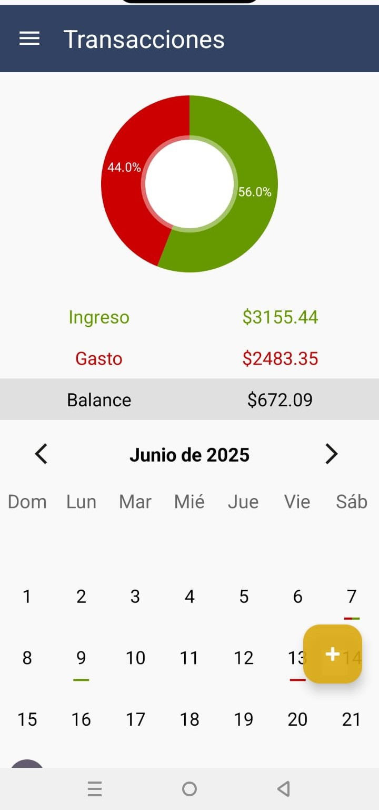
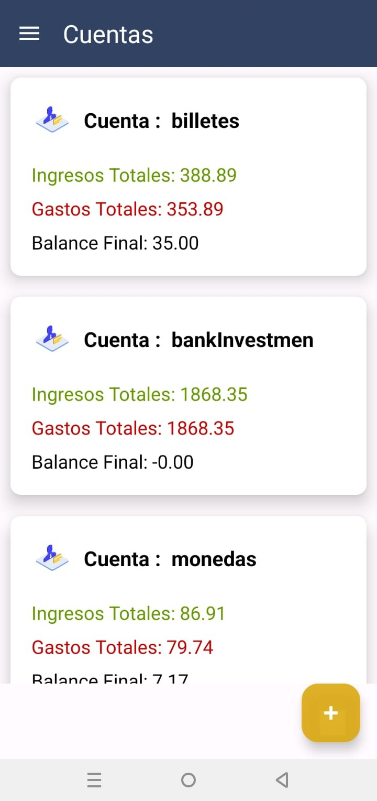
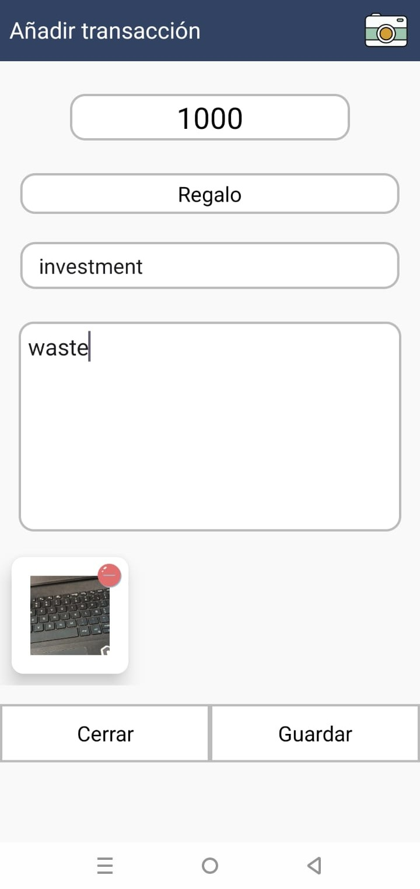

# 💰 Save Money App – Gestión de Finanzas Personales

<div align="center">


**Una aplicación móvil intuitiva para el control total de tus finanzas personales**

[🚀 Características](#-características-principales) • [📱 Capturas](#-capturas-de-pantalla) • [🛠️ Instalación](#️-instalación-y-configuración) • [🗄️ Base de Datos](#️-estructura-de-la-base-de-datos)

</div>

---

## 📖 Descripción General

Save Money App es una aplicación móvil Android desarrollada en **Kotlin** que revoluciona la forma en que gestionas tus finanzas personales. Con una interfaz intuitiva y características avanzadas, te permite registrar ingresos, gastos, cuentas y visualizar tu situación financiera mediante gráficos interactivos y un calendario dinámico.

### 🎯 Características Clave

- 📱 **Interfaz Nativa**: Desarrollada completamente en Kotlin para Android
- ☁️ **Backend Robusto**: Integración completa con Supabase para datos y autenticación
- 📊 **Visualización Avanzada**: Gráficos circulares y calendario financiero interactivo
- 🔒 **Seguridad**: Autenticación segura con Supabase Auth
- 📸 **Adjuntos**: Soporte para imágenes en transacciones

---

## ✨ Características Principales

<table>
<tr>
<td width="50%">

### 📊 **Visualización Financiera**
- ✅ Gráfico circular de ingresos vs gastos
- ✅ Calendario interactivo con código de colores
- ✅ Resumen mensual de transacciones
- ✅ Dashboard principal con estadísticas

### 💰 **Gestión de Transacciones**
- ✅ Registro de ingresos y gastos
- ✅ Categorización automática
- ✅ Edición y eliminación de registros
- ✅ Adjuntar imágenes a transacciones

</td>
<td width="50%">

### 🏦 **Gestión de Cuentas**
- ✅ Múltiples cuentas bancarias
- ✅ Organización por tipo de cuenta
- ✅ Seguimiento de saldos
- ✅ Historial completo por cuenta

### 🔐 **Seguridad y Sincronización**
- ✅ Autenticación segura con email
- ✅ Sincronización en la nube
- ✅ Backup automático de datos
- ✅ Acceso desde múltiples dispositivos

</td>
</tr>
</table>

---

## 📱 Capturas de Pantalla

> **Dashboard principal con gráfico circular, calendario financiero y resumen de transacciones**

### 📊 Visualizaciones Financieras
<table>
<tr>
<td width="33%" align="center">


**Calendario Financiero**
- Navegación por meses
- Vista rápida de transacciones
- Proporción ingresos/gastos


</td>
<td width="33%" align="center">


**Tipos de cuentas**
- Valores divididois por cuenta
- Ganacia o perdida por cuenta
- Edicion de cuentas
</td>
<td width="33%" align="center">


**Lista de Transacciones**
- Añadir notas y tipos de transaccion
- Añadir imagenes
- Añadir tipo de cuenta

</td>
</tr>
</table>

### ➕ Gestión de Transacciones
<div align="center">
  
</div>

> **Diálogo intuitivo para agregar ingresos o gastos con categorías y cuentas**

---

## 🏗️ Arquitectura del Sistema

<table>
<tr>
<td width="25%" align="center">

### 📱

**Presentation Layer**

Activities, Fragments y Adapters que manejan la interfaz de usuario

</td>
<td width="25%" align="center">

### 🧠

**Business Logic**

DataManager y Utils que procesan la lógica de negocio

</td>
<td width="25%" align="center">

### 📊

**Data Layer**

Modelos y cliente Supabase para persistencia

</td>
<td width="25%" align="center">

### ☁️

**Backend Services**

Supabase con PostgreSQL, Auth y Storage

</td>
</tr>
</table>

### 🗂️ Estructura del Proyecto

```
app/
├── 📱 Presentation Layer
│   ├── ui/                     # Fragments y pantallas
│   │   ├── fragments/          # Fragmentos reutilizables
│   │   └── dialogs/           # Diálogos personalizados
│   ├── adapter/               # Adaptadores de RecyclerView
│   └── MainActivity.kt        # Actividad principal
│
├── 🧠 Business Logic
│   ├── DataManager/           # Lógica de negocio
│   │   ├── TransactionManager.kt
│   │   ├── AccountManager.kt
│   │   └── StatisticsManager.kt
│   └── utils/                 # Funciones utilitarias
│       ├── DateUtils.kt
│       ├── ColorUtils.kt
│       └── ValidationUtils.kt
│
├── 📊 Data Layer
│   ├── models/                # Modelos de datos
│   │   ├── Transaction.kt
│   │   ├── Account.kt
│   │   ├── Category.kt
│   │   └── User.kt
│   └── SupabaseClient.kt      # Cliente de conexión
│
└── 🎨 Resources
    ├── res/layout/            # Layouts XML
    ├── res/values/           # Colores, strings, estilos
    └── res/drawable/         # Iconos y gráficos
```

---

## 🛠️ Instalación y Configuración

### Requisitos Previos
- Android Studio Electric Eel o superior
- Kotlin 1.8+
- SDK de Android API 24+
- Cuenta activa de Supabase

### 🚀 Configuración Rápida

```bash
# 1️⃣ Clonar el repositorio
git clone https://github.com/tu-usuario/save-money-app.git
cd save-money-app

# 2️⃣ Abrir en Android Studio
# File → Open → Seleccionar carpeta del proyecto

# 3️⃣ Configurar Supabase
# Crear archivo SupabaseClient.kt (ver sección de configuración)

# 4️⃣ Sincronizar dependencias
# Build → Make Project

# 5️⃣ Ejecutar aplicación
# Run → Run 'app'
```

### 🔐 Configuración de Supabase

<details>
<summary><b>📄 Crear SupabaseClient.kt</b></summary>

```kotlin
// 📁 Ruta: app/src/main/java/com/edisoninnovations/save_money/SupabaseClient.kt

package com.edisoninnovations.save_money

import io.github.jan.supabase.createSupabaseClient
import io.github.jan.supabase.functions.Functions
import io.github.jan.supabase.gotrue.Auth
import io.github.jan.supabase.postgrest.Postgrest
import io.github.jan.supabase.storage.Storage

val supabase = createSupabaseClient(
    supabaseUrl = "TU_SUPABASE_URL_AQUI",
    supabaseKey = "TU_SUPABASE_ANON_KEY_AQUI"
) {
    install(Postgrest)
    install(Auth)
    install(Storage)
    // install(Functions) // Opcional para funciones RPC
}
```

> ⚠️ **Importante**: Este archivo está en `.gitignore` por seguridad. Debes crear tu propia versión con tus credenciales.

</details>

---

## 🗄️ Estructura de la Base de Datos

<div align="center">
  
</div>

> **Diagrama completo del esquema relacional de la base de datos en Supabase**

### 📊 Tablas Principales

<details>
<summary><b>🏦 Tabla: accounts</b></summary>

| Campo | Tipo | Descripción | Restricciones |
|-------|------|-------------|---------------|
| `id_account` | `int4` | ID único de la cuenta | **PK**, Auto-increment |
| `id_usuario` | `uuid` | ID del usuario propietario | **FK** → auth.users |
| `title` | `text` | Nombre descriptivo de la cuenta | **NOT NULL** |
| `created_at` | `timestamp` | Fecha de creación | **DEFAULT NOW()** |

**Ejemplo de datos:**
```sql
INSERT INTO accounts (id_usuario, title) VALUES 
('123e4567-e89b-12d3-a456-426614174000', 'Cuenta Corriente Banco Pichincha'),
('123e4567-e89b-12d3-a456-426614174000', 'Efectivo'),
('123e4567-e89b-12d3-a456-426614174000', 'Tarjeta de Crédito Visa');
```

</details>

<details>
<summary><b>💰 Tabla: transacciones</b></summary>

| Campo | Tipo | Descripción | Restricciones |
|-------|------|-------------|---------------|
| `id_transaccion` | `int4` | ID único de la transacción | **PK**, Auto-increment |
| `id_categoria` | `int4` | Categoría asociada | **FK** → categorias.id |
| `nota` | `text` | Descripción o nota | Opcional |
| `tipo` | `text` | Tipo de transacción | **CHECK** ('income', 'expense') |
| `cantidad` | `numeric(10,2)` | Monto de la transacción | **NOT NULL**, > 0 |
| `id_usuario` | `uuid` | Usuario propietario | **FK** → auth.users |
| `fecha` | `date` | Fecha de la transacción | **NOT NULL** |
| `tiempo` | `time` | Hora de creación | **DEFAULT NOW()** |
| `id_account` | `int4` | Cuenta asociada | **FK** → accounts.id_account |

**Índices optimizados:**
```sql
CREATE INDEX idx_transacciones_usuario_fecha ON transacciones(id_usuario, fecha);
CREATE INDEX idx_transacciones_tipo ON transacciones(tipo);
```

</details>

<details>
<summary><b>🏷️ Tabla: categorias</b></summary>

| Campo | Tipo | Descripción | Restricciones |
|-------|------|-------------|---------------|
| `id` | `int4` | ID único de categoría | **PK**, Auto-increment |
| `nombre_categoria` | `varchar(100)` | Nombre de la categoría | **UNIQUE**, **NOT NULL** |
| `tipo_categoria` | `text` | Tipo (income/expense/both) | **DEFAULT** 'both' |
| `icono` | `varchar(50)` | Nombre del icono | Opcional |

**Categorías predefinidas:**
```sql
INSERT INTO categorias (nombre_categoria, tipo_categoria) VALUES 
('Salario', 'income'),
('Freelance', 'income'),
('Alimentación', 'expense'),
('Transporte', 'expense'),
('Entretenimiento', 'expense'),
('Servicios', 'expense');
```

</details>

<details>
<summary><b>🖼️ Tabla: transimages</b></summary>

| Campo | Tipo | Descripción | Restricciones |
|-------|------|-------------|---------------|
| `id_image` | `int4` | ID único de imagen | **PK**, Auto-increment |
| `id_transaccion` | `int4` | Transacción asociada | **FK** → transacciones.id_transaccion |
| `imagen` | `text` | Nombre del archivo en Storage | **NOT NULL** |
| `uploaded_at` | `timestamp` | Fecha de subida | **DEFAULT NOW()** |

</details>

<details>
<summary><b>👤 Tabla: profile</b></summary>

| Campo | Tipo | Descripción | Restricciones |
|-------|------|-------------|---------------|
| `user_id` | `uuid` | ID del usuario | **PK**, **FK** → auth.users |
| `name` | `text` | Nombre del usuario | Opcional |
| `last_name` | `text` | Apellido del usuario | Opcional |
| `avatar_url` | `text` | URL del avatar | Opcional |
| `created_at` | `timestamp` | Fecha de registro | **DEFAULT NOW()** |

</details>

---

## ⚙️ Funciones RPC (Stored Procedures)

### 🔍 get_transactions_by_date_and_user

```sql
CREATE OR REPLACE FUNCTION get_transactions_by_date_and_user(
    p_fecha DATE,
    p_id_usuario UUID
)
RETURNS TABLE (
    id_transaccion INT4,
    nombre_categoria VARCHAR,
    nota TEXT,
    tipo TEXT,
    cantidad NUMERIC,
    id_usuario UUID,
    fecha DATE,
    id_account INT4,
    title TEXT
) 
LANGUAGE plpgsql
SECURITY INVOKER
AS $$
BEGIN
    RETURN QUERY
    SELECT 
        t.id_transaccion,
        c.nombre_categoria,
        t.nota,
        t.tipo,
        t.cantidad,
        t.id_usuario,
        t.fecha,
        a.id_account,
        a.title
    FROM 
        transacciones t
    JOIN categorias c ON t.id_categoria = c.id
    LEFT JOIN accounts a ON t.id_account = a.id_account
    WHERE 
        t.fecha = p_fecha
        AND t.id_usuario = p_id_usuario
    ORDER BY t.tiempo DESC;
END;
$$;
```

### 📊 get_transactions_by_user

```sql
CREATE OR REPLACE FUNCTION get_transactions_by_user(user_id UUID)
RETURNS TABLE (
    cantidad NUMERIC,
    tipo TEXT,
    fecha DATE,
    id_account INT4,
    title TEXT
) 
LANGUAGE plpgsql
SECURITY INVOKER
AS $$
BEGIN
    RETURN QUERY
    SELECT 
        t.cantidad,
        t.tipo,
        t.fecha,
        a.id_account,
        a.title
    FROM transacciones t
    LEFT JOIN accounts a ON t.id_account = a.id_account
    WHERE t.id_usuario = user_id
    ORDER BY t.fecha DESC, t.tiempo DESC;
END;
$$;
```

### 🗑️ eliminar_cuenta_y_actualizar_transacciones

```sql
CREATE OR REPLACE FUNCTION eliminar_cuenta_y_actualizar_transacciones(
    account_id_to_delete INT4
)
RETURNS VOID
LANGUAGE plpgsql
SECURITY INVOKER
AS $$
BEGIN
    -- Actualizar transacciones: establecer id_account a NULL
    UPDATE transacciones
    SET id_account = NULL
    WHERE id_account = account_id_to_delete;

    -- Eliminar la cuenta
    DELETE FROM accounts
    WHERE id_account = account_id_to_delete;
    
    -- Log de la operación
    RAISE NOTICE 'Cuenta % eliminada y transacciones actualizadas', account_id_to_delete;
END;
$$;
```

---

## 🛡️ Tecnologías Utilizadas

<div align="center">


</div>

### 🔧 Dependencias Principales

```kotlin
dependencies {
    // Core Android
    implementation("androidx.core:core-ktx:1.10.1")
    implementation("androidx.appcompat:appcompat:1.6.1")
    implementation("com.google.android.material:material:1.9.0")
    implementation("androidx.constraintlayout:constraintlayout:2.1.4")
    
    // ViewPager2 para calendario
    implementation("androidx.viewpager2:viewpager2:1.0.0")
    
    // Gráficos - MPAndroidChart
    implementation("com.github.PhilJay:MPAndroidChart:v3.1.0")
    
    // Supabase
    implementation("io.github.jan-tennert.supabase:postgrest-kt:2.0.0")
    implementation("io.github.jan-tennert.supabase:gotrue-kt:2.0.0")
    implementation("io.github.jan-tennert.supabase:storage-kt:2.0.0")
    implementation("io.github.jan-tennert.supabase:functions-kt:2.0.0")
    
    // JSON parsing
    implementation("com.squareup.moshi:moshi-kotlin:1.14.0")
    implementation("com.squareup.moshi:moshi-kotlin-codegen:1.14.0")
    
    // Coroutines
    implementation("org.jetbrains.kotlinx:kotlinx-coroutines-android:1.7.1")
    
    // ViewModel y LiveData
    implementation("androidx.lifecycle:lifecycle-viewmodel-ktx:2.6.2")
    implementation("androidx.lifecycle:lifecycle-livedata-ktx:2.6.2")
    
    // Testing
    testImplementation("junit:junit:4.13.2")
    androidTestImplementation("androidx.test.ext:junit:1.1.5")
    androidTestImplementation("androidx.test.espresso:espresso-core:3.5.1")
}
```

---

## 🔐 Configuración de Seguridad

### 🛡️ Row Level Security (RLS)

```sql
-- Habilitar RLS en todas las tablas
ALTER TABLE transacciones ENABLE ROW LEVEL SECURITY;
ALTER TABLE accounts ENABLE ROW LEVEL SECURITY;
ALTER TABLE transimages ENABLE ROW LEVEL SECURITY;
ALTER TABLE profile ENABLE ROW LEVEL SECURITY;

-- Políticas de seguridad para transacciones
CREATE POLICY "Usuarios solo ven sus transacciones" ON transacciones
    FOR ALL USING (auth.uid() = id_usuario);

-- Políticas de seguridad para cuentas
CREATE POLICY "Usuarios solo ven sus cuentas" ON accounts
    FOR ALL USING (auth.uid() = id_usuario);

-- Políticas de seguridad para imágenes
CREATE POLICY "Usuarios solo ven imágenes de sus transacciones" ON transimages
    FOR ALL USING (
        EXISTS (
            SELECT 1 FROM transacciones t 
            WHERE t.id_transaccion = transimages.id_transaccion 
            AND t.id_usuario = auth.uid()
        )
    );
```

### 🔒 Storage Bucket Configuration

```sql
-- Crear bucket para imágenes
INSERT INTO storage.buckets (id, name, public) VALUES ('imagenes', 'imagenes', true);

-- Política de upload para imágenes
CREATE POLICY "Usuarios pueden subir sus imágenes" ON storage.objects
    FOR INSERT WITH CHECK (bucket_id = 'imagenes' AND auth.uid()::text = (storage.foldername(name))[1]);

-- Política de visualización
CREATE POLICY "Imágenes públicas de lectura" ON storage.objects
    FOR SELECT USING (bucket_id = 'imagenes');
```

---

## 🎨 Características de UI/UX

### 🎨 Sistema de Colores

```kotlin
// Colores del tema principal
object AppColors {
    val income = Color.parseColor("#4CAF50")      // Verde para ingresos
    val expense = Color.parseColor("#F44336")     // Rojo para gastos
    val mixed = Color.parseColor("#FF9800")       // Naranja para días mixtos
    val primary = Color.parseColor("#2196F3")     // Azul principal
    val primaryDark = Color.parseColor("#1976D2") // Azul oscuro
    val accent = Color.parseColor("#03DAC5")      // Verde agua
}
```

### 📊 Gráfico Circular Dinámico

```kotlin
private fun setupPieChart() {
    pieChart.apply {
        setUsePercentValues(true)
        description.isEnabled = false
        setExtraOffsets(5f, 10f, 5f, 5f)
        dragDecelerationFrictionCoef = 0.95f
        
        // Configuración de centro
        centerText = "Balance\nFinanciero"
        setCenterTextSize(16f)
        setCenterTextColor(ContextCompat.getColor(context, R.color.text_primary))
        
        // Animaciones
        animateY(1400, Easing.EaseInOutQuad)
        
        // Configuración de leyenda
        legend.apply {
            verticalAlignment = Legend.LegendVerticalAlignment.TOP
            horizontalAlignment = Legend.LegendHorizontalAlignment.RIGHT
            orientation = Legend.LegendOrientation.VERTICAL
            setDrawInside(false)
            xEntrySpace = 7f
            yEntrySpace = 0f
            yOffset = 0f
        }
    }
}
```

### 📅 Calendario Interactivo

El calendario utiliza `ViewPager2` con fragmentos personalizados para cada mes:

```kotlin
class CalendarAdapter(
    fragment: Fragment,
    private val startDate: LocalDate,
    private val endDate: LocalDate
) : FragmentStateAdapter(fragment) {

    override fun getItemCount(): Int {
        return ChronoUnit.MONTHS.between(startDate, endDate).toInt() + 1
    }

    override fun createFragment(position: Int): Fragment {
        val monthDate = startDate.plusMonths(position.toLong())
        return CalendarMonthFragment.newInstance(monthDate)
    }
}
```

---

## 📈 Funcionalidades Avanzadas

### 🔍 Búsqueda y Filtros

```kotlin
class TransactionFilter {
    var dateRange: Pair<LocalDate, LocalDate>? = null
    var accountIds: List<Int> = emptyList()
    var categoryIds: List<Int> = emptyList()
    var transactionType: TransactionType? = null
    var minAmount: BigDecimal? = null
    var maxAmount: BigDecimal? = null
    var searchQuery: String? = null
}
```

### 📊 Reportes y Estadísticas

```kotlin
data class FinancialSummary(
    val totalIncome: BigDecimal,
    val totalExpenses: BigDecimal,
    val balance: BigDecimal,
    val transactionCount: Int,
    val averageTransaction: BigDecimal,
    val categoryBreakdown: Map<String, BigDecimal>,
    val monthlyTrend: List<MonthlyData>
)
```

### 🔄 Sincronización Offline

```kotlin
class OfflineTransactionManager {
    private val pendingTransactions = mutableListOf<PendingTransaction>()
    
    suspend fun syncPendingTransactions() {
        pendingTransactions.forEach { pending ->
            try {
                when (pending.operation) {
                    Operation.CREATE -> createTransaction(pending.transaction)
                    Operation.UPDATE -> updateTransaction(pending.transaction)
                    Operation.DELETE -> deleteTransaction(pending.transactionId)
                }
                pendingTransactions.remove(pending)
            } catch (e: Exception) {
                Log.e("Sync", "Error syncing transaction: ${e.message}")
            }
        }
    }
}
```

---

## 🚀 Roadmap y Próximas Características

### 📋 Próximas Actualizaciones

<table>
<tr>
<td width="50%">

### 🎯 **Versión 2.0**
- [ ] 📊 Reportes avanzados en PDF
- [ ] 🔔 Notificaciones de presupuesto
- [ ] 💹 Análisis de tendencias con IA
- [ ] 🌙 Modo oscuro completo
- [ ] 📱 Widget para pantalla principal

</td>
<td width="50%">

### 🎯 **Versión 2.5**
- [ ] 🔄 Sincronización multi-dispositivo
- [ ] 💳 Integración con bancos
- [ ] 📈 Análisis predictivo
- [ ] 🎨 Temas personalizables
- [ ] 🗣️ Comandos de voz

</td>
</tr>
</table>

### 💡 Ideas de la Comunidad
- Integración con Google Drive para backups
- Soporte para múltiples monedas
- Recordatorios de pagos recurrentes
- Modo familiar para gastos compartidos
- Exportación a Excel/CSV

---

## 🤝 Contribuciones

¡Las contribuciones son bienvenidas! Aquí te explicamos cómo puedes ayudar:

### 🛠️ Cómo Contribuir

1. 🍴 **Fork** el repositorio
2. 🌱 **Crea** una rama para tu característica (`git checkout -b feature/NuevaCaracteristica`)
3. 💾 **Commit** tus cambios (`git commit -m 'Agregar nueva característica'`)
4. 📤 **Push** a la rama (`git push origin feature/NuevaCaracteristica`)
5. 🔄 **Abre** un Pull Request

### 🐛 Reportar Bugs

Si encuentras un bug, por favor abre un issue con:
- Descripción detallada del problema
- Pasos para reproducir el bug
- Versión de Android y dispositivo
- Screenshots si es posible

### 💡 Sugerir Características

¿Tienes una idea genial? ¡Nos encantaría escucharla!
- Abre un issue con la etiqueta `enhancement`
- Describe la funcionalidad deseada
- Explica el caso de uso

---

## 📄 Licencia

Este proyecto está licenciado bajo la Licencia MIT - ver el archivo [LICENSE.md](LICENSE.md) para más detalles.

```
MIT License

Copyright (c) 2024 Edison Innovations

Permission is hereby granted, free of charge, to any person obtaining a copy
of this software and associated documentation files (the "Software"), to deal
in the Software without restriction, including without limitation the rights
to use, copy, modify, merge, publish, distribute, sublicense, and/or sell
copies of the Software, and to permit persons to whom the Software is
furnished to do so, subject to the following conditions:

The above copyright notice and this permission notice shall be included in all
copies or substantial portions of the Software.
```

---

## 🙏 Agradecimientos

- **Supabase** por proporcionar una plataforma backend robusta y fácil de usar
- **MPAndroidChart** por la excelente librería de gráficos
- **Material Design** por las guías de diseño y componentes
- **Comunidad de Kotlin** por el lenguaje y herramientas excepcionales
- **Todos los beta testers** que ayudaron a mejorar la aplicación

---

## 📞 Contacto y Soporte

<div align="center">

### ¿Necesitas ayuda o tienes preguntas?

📧 **Email**: edison.innovations.dev@gmail.com  
🐛 **Issues**: [GitHub Issues](https://github.com/tu-usuario/save-money-app/issues)  
📱 **Telegram**: [@EdisonInnovations](https://t.me/EdisonInnovations)  

</div>

---

<div align="center">

### ⭐ ¡Dale una estrella a este repositorio si te ha sido útil!

**Desarrollado con ❤️ y ☕ para la comunidad de finanzas personales**


</div>
