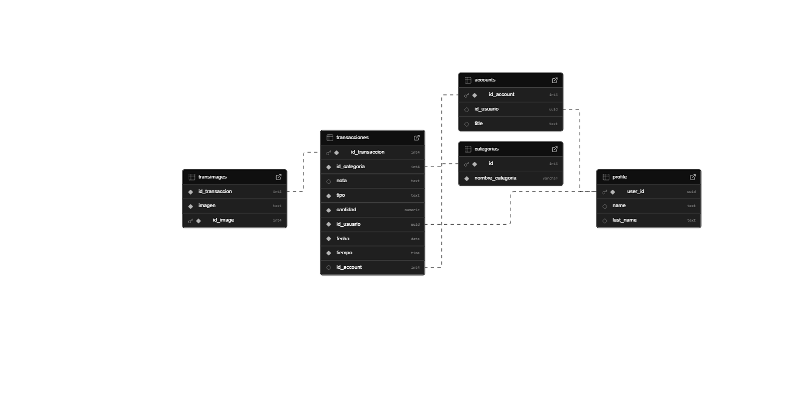

# 💰 Save Money App – Personal Finance Management

<div align="center">


**An intuitive mobile application for complete control of your personal finances**

[🚀 Features](#-key-features) • [📱 Screenshots](#-screenshots) • [🛠️ Installation](#️-installation-and-setup) • [🗄️ Database](#️-database-structure)

</div>

---

## 📖 General Overview

Save Money App is an Android mobile application developed in **Kotlin** that revolutionizes the way you manage your personal finances. With an intuitive interface and advanced features, it allows you to record income, expenses, accounts and visualize your financial situation through interactive charts and a dynamic calendar.

### 🎯 Key Features

- 📱 **Native Interface**: Fully developed in Kotlin for Android
- ☁️ **Robust Backend**: Complete integration with Supabase for data and authentication
- 📊 **Advanced Visualization**: Pie charts and interactive financial calendar
- 🔒 **Security**: Secure authentication with Supabase Auth
- 📸 **Attachments**: Support for images in transactions

---

## ✨ Main Features

<table>
<tr>
<td width="50%">

### 📊 **Financial Visualization**
- ✅ Pie chart of income vs expenses
- ✅ Interactive calendar with color coding
- ✅ Monthly transaction summary
- ✅ Main dashboard with statistics

### 💰 **Transaction Management**
- ✅ Recording income and expenses
- ✅ Automatic categorization
- ✅ Editing and deleting records
- ✅ Attach images to transactions

</td>
<td width="50%">

### 🏦 **Account Management**
- ✅ Multiple bank accounts
- ✅ Organization by account type
- ✅ Balance tracking
- ✅ Complete history per account

### 🔐 **Security and Synchronization**
- ✅ Secure email authentication
- ✅ Cloud synchronization
- ✅ Automatic data backup
- ✅ Multi-device access

</td>
</tr>
</table>

---

## 📱 Screenshots

> **Main dashboard with pie chart, financial calendar and transaction summary**

### 📊 Financial Visualizations
<table>
<tr>
<td width="33%" align="center">


**Financial Calendar**
- Navigate by months
- Quick transaction view
- Income/expense ratio

</td>
<td width="33%" align="center">


**Account Types**
- Values divided by account
- Profit or loss per account
- Account editing
</td>
<td width="33%" align="center">


**Add Transactions**
- Add details
- Add images
- Add account type

</td>
</tr>
</table>

### ➕ Transaction Management
<div align="center">
  
</div>

> **Intuitive dialog to add income or expenses with categories and accounts**

---

## 🏗️ System Architecture

<table>
<tr>
<td width="25%" align="center">

### 📱

**Presentation Layer**

Activities, Fragments and Adapters that handle the user interface

</td>
<td width="25%" align="center">

### 🧠

**Business Logic**

DataManager and Utils that process business logic

</td>
<td width="25%" align="center">

### 📊

**Data Layer**

Models and Supabase client for persistence

</td>
<td width="25%" align="center">

### ☁️

**Backend Services**

Supabase with PostgreSQL, Auth and Storage

</td>
</tr>
</table>

### 🗂️ Project Structure

```
app/
├── 📱 Presentation Layer
│   ├── ui/                     # Fragments and screens
│   │   ├── fragments/          # Reusable fragments
│   │   └── dialogs/           # Custom dialogs
│   ├── adapter/               # RecyclerView adapters
│   └── MainActivity.kt        # Main activity
│
├── 🧠 Business Logic
│   ├── DataManager/           # Business logic
│   │   ├── TransactionManager.kt
│   │   ├── AccountManager.kt
│   │   └── StatisticsManager.kt
│   └── utils/                 # Utility functions
│       ├── DateUtils.kt
│       ├── ColorUtils.kt
│       └── ValidationUtils.kt
│
├── 📊 Data Layer
│   ├── models/                # Data models
│   │   ├── Transaction.kt
│   │   ├── Account.kt
│   │   ├── Category.kt
│   │   └── User.kt
│   └── SupabaseClient.kt      # Connection client
│
└── 🎨 Resources
    ├── res/layout/            # XML layouts
    ├── res/values/           # Colors, strings, styles
    └── res/drawable/         # Icons and graphics
```

---

## 🛠️ Installation and Setup

### Prerequisites
- Android Studio Electric Eel or higher
- Kotlin 1.8+
- Android SDK API 24+
- Active Supabase account

### 🚀 Quick Setup

```bash
# 1️⃣ Clone the repository
git clone https://github.com/your-user/save-money-app.git
cd save-money-app

# 2️⃣ Open in Android Studio
# File → Open → Select project folder

# 3️⃣ Configure Supabase
# Create SupabaseClient.kt file (see configuration section)

# 4️⃣ Sync dependencies
# Build → Make Project

# 5️⃣ Run application
# Run → Run 'app'
```

### 🔐 Supabase Configuration

<details>
<summary><b>📄 Create SupabaseClient.kt</b></summary>

```kotlin
// 📁 Path: app/src/main/java/com/edisoninnovations/save_money/SupabaseClient.kt

package com.edisoninnovations.save_money

import io.github.jan.supabase.createSupabaseClient
import io.github.jan.supabase.functions.Functions
import io.github.jan.supabase.gotrue.Auth
import io.github.jan.supabase.postgrest.Postgrest
import io.github.jan.supabase.storage.Storage

val supabase = createSupabaseClient(
    supabaseUrl = "YOUR_SUPABASE_URL_HERE",
    supabaseKey = "YOUR_SUPABASE_ANON_KEY_HERE"
) {
    install(Postgrest)
    install(Auth)
    install(Storage)
    // install(Functions) // Optional for RPC functions
}
```

> ⚠️ **Important**: This file is in `.gitignore` for security. You must create your own version with your credentials.

</details>

---

## 🗄️ Database Structure

<div align="center">
  
</div>

> **Complete diagram of the relational schema of the Supabase database**

### 📊 Main Tables

<details>
<summary><b>🏦 Table: accounts</b></summary>

| Field | Type | Description | Constraints |
|-------|------|-------------|-------------|
| `id_account` | `int4` | Unique account ID | **PK**, Auto-increment |
| `id_usuario` | `uuid` | Owner user ID | **FK** → auth.users |
| `title` | `text` | Descriptive account name | **NOT NULL** |
| `created_at` | `timestamp` | Creation date | **DEFAULT NOW()** |

**Data example:**
```sql
INSERT INTO accounts (id_usuario, title) VALUES 
('123e4567-e89b-12d3-a456-426614174000', 'Checking Account Banco Pichincha'),
('123e4567-e89b-12d3-a456-426614174000', 'Cash'),
('123e4567-e89b-12d3-a456-426614174000', 'Visa Credit Card');
```

</details>

<details>
<summary><b>💰 Table: transacciones</b></summary>

| Field | Type | Description | Constraints |
|-------|------|-------------|-------------|
| `id_transaccion` | `int4` | Unique transaction ID | **PK**, Auto-increment |
| `id_categoria` | `int4` | Associated category | **FK** → categorias.id |
| `nota` | `text` | Description or note | Optional |
| `tipo` | `text` | Transaction type | **CHECK** ('income', 'expense') |
| `cantidad` | `numeric(10,2)` | Transaction amount | **NOT NULL**, > 0 |
| `id_usuario` | `uuid` | Owner user | **FK** → auth.users |
| `fecha` | `date` | Transaction date | **NOT NULL** |
| `tiempo` | `time` | Creation time | **DEFAULT NOW()** |
| `id_account` | `int4` | Associated account | **FK** → accounts.id_account |

**Optimized indexes:**
```sql
CREATE INDEX idx_transacciones_usuario_fecha ON transacciones(id_usuario, fecha);
CREATE INDEX idx_transacciones_tipo ON transacciones(tipo);
```

</details>

<details>
<summary><b>🏷️ Table: categorias</b></summary>

| Field | Type | Description | Constraints |
|-------|------|-------------|-------------|
| `id` | `int4` | Unique category ID | **PK**, Auto-increment |
| `nombre_categoria` | `varchar(100)` | Category name | **UNIQUE**, **NOT NULL** |
| `tipo_categoria` | `text` | Type (income/expense/both) | **DEFAULT** 'both' |
| `icono` | `varchar(50)` | Icon name | Optional |

**Predefined categories:**
```sql
INSERT INTO categorias (nombre_categoria, tipo_categoria) VALUES 
('Salary', 'income'),
('Freelance', 'income'),
('Food', 'expense'),
('Transportation', 'expense'),
('Entertainment', 'expense'),
('Services', 'expense');
```

</details>

<details>
<summary><b>🖼️ Table: transimages</b></summary>

| Field | Type | Description | Constraints |
|-------|------|-------------|-------------|
| `id_image` | `int4` | Unique image ID | **PK**, Auto-increment |
| `id_transaccion` | `int4` | Associated transaction | **FK** → transacciones.id_transaccion |
| `imagen` | `text` | File name in Storage | **NOT NULL** |
| `uploaded_at` | `timestamp` | Upload date | **DEFAULT NOW()** |

</details>

<details>
<summary><b>👤 Table: profile</b></summary>

| Field | Type | Description | Constraints |
|-------|------|-------------|-------------|
| `user_id` | `uuid` | User ID | **PK**, **FK** → auth.users |
| `name` | `text` | User name | Optional |
| `last_name` | `text` | User last name | Optional |
| `avatar_url` | `text` | Avatar URL | Optional |
| `created_at` | `timestamp` | Registration date | **DEFAULT NOW()** |

</details>

---

## ⚙️ RPC Functions (Stored Procedures)

### 🔍 get_transactions_by_date_and_user

```sql
CREATE OR REPLACE FUNCTION get_transactions_by_date_and_user(
    p_fecha DATE,
    p_id_usuario UUID
)
RETURNS TABLE (
    id_transaccion INT4,
    nombre_categoria VARCHAR,
    nota TEXT,
    tipo TEXT,
    cantidad NUMERIC,
    id_usuario UUID,
    fecha DATE,
    id_account INT4,
    title TEXT
) 
LANGUAGE plpgsql
SECURITY INVOKER
AS $$
BEGIN
    RETURN QUERY
    SELECT 
        t.id_transaccion,
        c.nombre_categoria,
        t.nota,
        t.tipo,
        t.cantidad,
        t.id_usuario,
        t.fecha,
        a.id_account,
        a.title
    FROM 
        transacciones t
    JOIN categorias c ON t.id_categoria = c.id
    LEFT JOIN accounts a ON t.id_account = a.id_account
    WHERE 
        t.fecha = p_fecha
        AND t.id_usuario = p_id_usuario
    ORDER BY t.tiempo DESC;
END;
$$;
```

### 📊 get_transactions_by_user

```sql
CREATE OR REPLACE FUNCTION get_transactions_by_user(user_id UUID)
RETURNS TABLE (
    cantidad NUMERIC,
    tipo TEXT,
    fecha DATE,
    id_account INT4,
    title TEXT
) 
LANGUAGE plpgsql
SECURITY INVOKER
AS $$
BEGIN
    RETURN QUERY
    SELECT 
        t.cantidad,
        t.tipo,
        t.fecha,
        a.id_account,
        a.title
    FROM transacciones t
    LEFT JOIN accounts a ON t.id_account = a.id_account
    WHERE t.id_usuario = user_id
    ORDER BY t.fecha DESC, t.tiempo DESC;
END;
$$;
```

### 🗑️ eliminar_cuenta_y_actualizar_transacciones

```sql
CREATE OR REPLACE FUNCTION eliminar_cuenta_y_actualizar_transacciones(
    account_id_to_delete INT4
)
RETURNS VOID
LANGUAGE plpgsql
SECURITY INVOKER
AS $$
BEGIN
    -- Update transactions: set id_account to NULL
    UPDATE transacciones
    SET id_account = NULL
    WHERE id_account = account_id_to_delete;

    -- Delete the account
    DELETE FROM accounts
    WHERE id_account = account_id_to_delete;
    
    -- Operation log
    RAISE NOTICE 'Account % deleted and transactions updated', account_id_to_delete;
END;
$$;
```

---

## 🛡️ Technologies Used

<div align="center">


</div>

### 🔧 Main Dependencies

```kotlin
dependencies {
    // Core Android
    implementation("androidx.core:core-ktx:1.10.1")
    implementation("androidx.appcompat:appcompat:1.6.1")
    implementation("com.google.android.material:material:1.9.0")
    implementation("androidx.constraintlayout:constraintlayout:2.1.4")
    
    // ViewPager2 for calendar
    implementation("androidx.viewpager2:viewpager2:1.0.0")
    
    // Charts - MPAndroidChart
    implementation("com.github.PhilJay:MPAndroidChart:v3.1.0")
    
    // Supabase
    implementation("io.github.jan-tennert.supabase:postgrest-kt:2.0.0")
    implementation("io.github.jan-tennert.supabase:gotrue-kt:2.0.0")
    implementation("io.github.jan-tennert.supabase:storage-kt:2.0.0")
    implementation("io.github.jan-tennert.supabase:functions-kt:2.0.0")
    
    // JSON parsing
    implementation("com.squareup.moshi:moshi-kotlin:1.14.0")
    implementation("com.squareup.moshi:moshi-kotlin-codegen:1.14.0")
    
    // Coroutines
    implementation("org.jetbrains.kotlinx:kotlinx-coroutines-android:1.7.1")
    
    // ViewModel and LiveData
    implementation("androidx.lifecycle:lifecycle-viewmodel-ktx:2.6.2")
    implementation("androidx.lifecycle:lifecycle-livedata-ktx:2.6.2")
    
    // Testing
    testImplementation("junit:junit:4.13.2")
    androidTestImplementation("androidx.test.ext:junit:1.1.5")
    androidTestImplementation("androidx.test.espresso:espresso-core:3.5.1")
}
```

---

## 🔐 Security Configuration

### 🛡️ Row Level Security (RLS)

```sql
-- Enable RLS on all tables
ALTER TABLE transacciones ENABLE ROW LEVEL SECURITY;
ALTER TABLE accounts ENABLE ROW LEVEL SECURITY;
ALTER TABLE transimages ENABLE ROW LEVEL SECURITY;
ALTER TABLE profile ENABLE ROW LEVEL SECURITY;

-- Security policies for transactions
CREATE POLICY "Users only see their transactions" ON transacciones
    FOR ALL USING (auth.uid() = id_usuario);

-- Security policies for accounts
CREATE POLICY "Users only see their accounts" ON accounts
    FOR ALL USING (auth.uid() = id_usuario);

-- Security policies for images
CREATE POLICY "Users only see images from their transactions" ON transimages
    FOR ALL USING (
        EXISTS (
            SELECT 1 FROM transacciones t 
            WHERE t.id_transaccion = transimages.id_transaccion 
            AND t.id_usuario = auth.uid()
        )
    );
```

### 🔒 Storage Bucket Configuration

```sql
-- Create bucket for images
INSERT INTO storage.buckets (id, name, public) VALUES ('imagenes', 'imagenes', true);

-- Upload policy for images
CREATE POLICY "Users can upload their images" ON storage.objects
    FOR INSERT WITH CHECK (bucket_id = 'imagenes' AND auth.uid()::text = (storage.foldername(name))[1]);

-- View policy
CREATE POLICY "Public read access to images" ON storage.objects
    FOR SELECT USING (bucket_id = 'imagenes');
```

---

## 🎨 UI/UX Features

### 🎨 Color System

```kotlin
// Main theme colors
object AppColors {
    val income = Color.parseColor("#4CAF50")      // Green for income
    val expense = Color.parseColor("#F44336")     // Red for expenses
    val mixed = Color.parseColor("#FF9800")       // Orange for mixed days
    val primary = Color.parseColor("#2196F3")     // Main blue
    val primaryDark = Color.parseColor("#1976D2") // Dark blue
    val accent = Color.parseColor("#03DAC5")      // Aqua green
}
```

### 📊 Dynamic Pie Chart

```kotlin
private fun setupPieChart() {
    pieChart.apply {
        setUsePercentValues(true)
        description.isEnabled = false
        setExtraOffsets(5f, 10f, 5f, 5f)
        dragDecelerationFrictionCoef = 0.95f
        
        // Center configuration
        centerText = "Financial\nBalance"
        setCenterTextSize(16f)
        setCenterTextColor(ContextCompat.getColor(context, R.color.text_primary))
        
        // Animations
        animateY(1400, Easing.EaseInOutQuad)
        
        // Legend configuration
        legend.apply {
            verticalAlignment = Legend.LegendVerticalAlignment.TOP
            horizontalAlignment = Legend.LegendHorizontalAlignment.RIGHT
            orientation = Legend.LegendOrientation.VERTICAL
            setDrawInside(false)
            xEntrySpace = 7f
            yEntrySpace = 0f
            yOffset = 0f
        }
    }
}
```

### 📅 Interactive Calendar

The calendar uses `ViewPager2` with custom fragments for each month:

```kotlin
class CalendarAdapter(
    fragment: Fragment,
    private val startDate: LocalDate,
    private val endDate: LocalDate
) : FragmentStateAdapter(fragment) {

    override fun getItemCount(): Int {
        return ChronoUnit.MONTHS.between(startDate, endDate).toInt() + 1
    }

    override fun createFragment(position: Int): Fragment {
        val monthDate = startDate.plusMonths(position.toLong())
        return CalendarMonthFragment.newInstance(monthDate)
    }
}
```

---

## 📈 Advanced Features

### 🔍 Search and Filters

```kotlin
class TransactionFilter {
    var dateRange: Pair<LocalDate, LocalDate>? = null
    var accountIds: List<Int> = emptyList()
    var categoryIds: List<Int> = emptyList()
    var transactionType: TransactionType? = null
    var minAmount: BigDecimal? = null
    var maxAmount: BigDecimal? = null
    var searchQuery: String? = null
}
```

### 📊 Reports and Statistics

```kotlin
data class FinancialSummary(
    val totalIncome: BigDecimal,
    val totalExpenses: BigDecimal,
    val balance: BigDecimal,
    val transactionCount: Int,
    val averageTransaction: BigDecimal,
    val categoryBreakdown: Map<String, BigDecimal>,
    val monthlyTrend: List<MonthlyData>
)
```

### 🔄 Offline Synchronization

```kotlin
class OfflineTransactionManager {
    private val pendingTransactions = mutableListOf<PendingTransaction>()
    
    suspend fun syncPendingTransactions() {
        pendingTransactions.forEach { pending ->
            try {
                when (pending.operation) {
                    Operation.CREATE -> createTransaction(pending.transaction)
                    Operation.UPDATE -> updateTransaction(pending.transaction)
                    Operation.DELETE -> deleteTransaction(pending.transactionId)
                }
                pendingTransactions.remove(pending)
            } catch (e: Exception) {
                Log.e("Sync", "Error syncing transaction: ${e.message}")
            }
        }
    }
}
```

---

## 🚀 Roadmap and Upcoming Features

### 📋 Next Updates

<table>
<tr>
<td width="50%">

### 🎯 **Version 2.0**
- [ ] 📊 Advanced PDF reports
- [ ] 🔔 Budget notifications
- [ ] 💹 AI trend analysis
- [ ] 🌙 Complete dark mode
- [ ] 📱 Home screen widget

</td>
<td width="50%">

### 🎯 **Version 2.5**
- [ ] 🔄 Multi-device synchronization
- [ ] 💳 Bank integration
- [ ] 📈 Predictive analysis
- [ ] 🎨 Customizable themes
- [ ] 🗣️ Voice commands

</td>
</tr>
</table>

### 💡 Community Ideas
- Google Drive integration for backups
- Multi-currency support
- Recurring payment reminders
- Family mode for shared expenses
- Excel/CSV export

---

## 🤝 Contributions

Contributions are welcome! Here's how you can help:

### 🛠️ How to Contribute

1. 🍴 **Fork** the repository
2. 🌱 **Create** a branch for your feature (`git checkout -b feature/NewFeature`)
3. 💾 **Commit** your changes (`git commit -m 'Add new feature'`)
4. 📤 **Push** to the branch (`git push origin feature/NewFeature`)
5. 🔄 **Open** a Pull Request

### 🐛 Report Bugs

If you find a bug, please open an issue with:
- Detailed description of the problem
- Steps to reproduce the bug
- Android version and device
- Screenshots if possible

### 💡 Suggest Features

Do you have a great idea? We'd love to hear it!
- Open an issue with the `enhancement` label
- Describe the desired functionality
- Explain the use case

---

<div align="center">

### ⭐ Give this repository a star if it has been useful to you!

</div>
